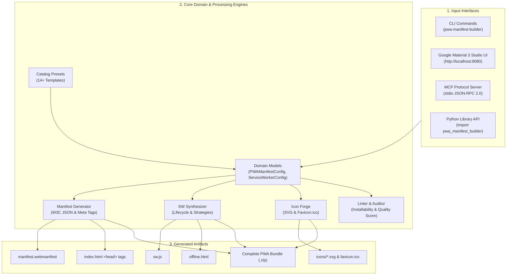

# Google PWA Studio & Manifest Builder 🚀

A zero-dependency, production-grade Progressive Web App (PWA) manifest generator, ServiceWorker architect, SVG icon forge, Lighthouse installability linter, Model Context Protocol (MCP) server, and Google Material 3 Web Studio UI.

**100% Python Standard Library** — zero third-party runtime dependencies. Runs everywhere Python 3.9+ runs (Linux, macOS, Windows, Termux/Android).

---

## 🌟 Key Capabilities

- 📋 **W3C Web App Manifest Generator**: Full schema compliance with Chromium & iOS installability requirements (`display`, `orientation`, `theme_color`, `background_color`, `shortcuts`, `share_target`, `file_handlers`, and `screenshots`).
- ⚡ **ServiceWorker Architect**: Synthesizes production-ready JavaScript Service Workers supporting `StaleWhileRevalidate`, `CacheFirst`, `NetworkFirst`, `NetworkOnly`, and `CacheOnly` caching strategies, atomic cache versioning, navigation preload, offline fallback routing, background sync, and push notifications.
- 🎨 **Pure-Python Icon Forge**: Generates vector SVG icons with 80% safe-zone adaptive maskable padding, standard resolution suites (`16x16` to `1024x1024`), Apple touch icons (`180x180`), and multi-resolution Windows `favicon.ico` binaries with zero imaging dependencies.
- 🔍 **Lighthouse Installability Linter**: Comprehensive audit scoring engine (0–100) assessing installability rules, maskable icons, scope containment, color safety, and actionable fix recommendations.
- 📱 **Google Material 3 Studio UI**: Interactive light/dark web studio featuring a Pixel mobile phone frame preview (Install banner bottom sheet, launch splash screen, and Android home screen grid), live tabbed code inspector, and 1-click complete PWA `.zip` bundle export.
- 🤖 **Model Context Protocol (MCP) Server**: Native JSON-RPC 2.0 stdio server seamlessly exposing tools to Claude Desktop, Cursor, Cline, Roo Code, and AI agents.
- 📦 **14+ Built-in Application Templates**: Instant blueprints for E-Commerce, SaaS Dashboards, News Readers, Offline Notebooks, Media Players, Developer Tools, Fullscreen Canvas Games, and AI Assistants.

---

## 🏛️ Architecture & Data Flow



---

## 🚀 Quick Start

### Installation

Install via pip or clone directly (zero runtime dependencies):

```bash
# Clone and install locally in editable mode
git clone https://github.com/example/pwa-manifest-builder.git
cd pwa-manifest-builder
pip install -e .
```

### Launch Google Material 3 Studio UI

```bash
pwa-manifest-builder serve --port 8080 --open
```

Open `http://localhost:8080` in your browser to design and preview your Progressive Web App.

---

## 📱 Google Material 3 Studio UI

The web studio (`/public/index.html` or served via `pwa-manifest-builder serve`) provides an interactive 3-column cockpit:

1. **Left Configurator Panel**:
   - Template Preset Picker (E-Commerce, SaaS, Game, Offline Notes, etc.)
   - Tabbed configuration: Basic Info, Display & Window, Scope & URLs, ServiceWorker & Caching, and Icon Forge.
2. **Center Dual-Mode Viewport**:
   - **📱 Live Device Preview**: Realistic Pixel mobile frame displaying:
     - Install bottom sheet dialog
     - App launch splash screen
     - Android homescreen icon badge
   - **💻 Code Inspector**: Real-time syntax-highlighted tabs for `manifest.webmanifest`, `sw.js`, `index.html <head>`, and `offline.html`.
3. **Right Audit Panel**:
   - Real-time animated Lighthouse Installability Gauge (0–100 score).
   - Checklist status pills (Manifest, Start URL, Display, 192/512 Icons, Maskable Icon, Theme Colors, ServiceWorker, Offline Route).
   - **1-Click Download Bundle (.ZIP)** button downloading a ready-to-deploy archive.

---

## 🛠️ CLI Reference

The CLI is available as `pwa-manifest-builder`, `pwa-builder`, or `pwabuild`:

### 1. Generate W3C Manifest

```bash
# Generate manifest and write to stdout
pwa-manifest-builder generate --name "My Progressive Web App" --short-name "MyApp" --theme-color "#1a73e8" --stdout

# Generate from built-in template to file
pwa-manifest-builder generate --template saas-dashboard --output ./public/manifest.webmanifest
```

### 2. Synthesize Service Worker

```bash
# Generate StaleWhileRevalidate service worker
pwa-manifest-builder sw --strategy stale_while_revalidate --cache-name my-cache-v1 -o ./public/sw.js

# Generate CacheFirst service worker with background sync
pwa-manifest-builder sw --strategy cache-first --sync --push -o ./public/sw.js
```

### 3. Build Full Icon Suite

```bash
# Forge SVG icon suite with maskable safe zones and favicon.ico
pwa-manifest-builder icons --name "Pulse" --bg-color "#1a73e8" -o ./public/icons
```

### 4. Audit PWA Manifest

```bash
# Audit an existing manifest file
pwa-manifest-builder audit ./public/manifest.webmanifest

# Output JSON audit report
pwa-manifest-builder audit ./public/manifest.webmanifest --json
```

### 5. Generate HTML `<head>` Meta Tags

```bash
pwa-manifest-builder meta --name "Acme App" --theme-color "#059669"
```

### 6. Explore Application Templates

```bash
pwa-manifest-builder templates
pwa-manifest-builder templates --category productivity
```

### 7. Run MCP Server

```bash
pwa-manifest-builder mcp
```

### 8. System Diagnostics

```bash
pwa-manifest-builder diagnostics
```

---

## 🤖 Model Context Protocol (MCP) Setup

`pwa-manifest-builder` contains a built-in MCP server communicating over JSON-RPC 2.0 stdio.

### Claude Desktop Configuration

Add the following to your `claude_desktop_config.json`:

```json
{
  "mcpServers": {
    "pwa-manifest-builder": {
      "command": "python",
      "args": ["-m", "pwa_manifest_builder.mcp_server"]
    }
  }
}
```

### Cursor Configuration

Add to `.cursor/mcp.json`:

```json
{
  "mcpServers": {
    "pwa-manifest-builder": {
      "command": "pwa-manifest-builder",
      "args": ["mcp"]
    }
  }
}
```

### Exposed MCP Tools

| Tool Name | Description |
| :--- | :--- |
| `pwa_generate_manifest` | Generates a validated W3C Web App Manifest JSON |
| `pwa_generate_sw` | Synthesizes a production Service Worker script with caching strategies |
| `pwa_generate_icons` | Generates SVG icons, maskable safe-zone icons, and favicon |
| `pwa_audit` | Validates a manifest against Lighthouse & W3C installability criteria |
| `pwa_list_templates` | Lists all 14+ built-in application templates |
| `pwa_html_meta_tags` | Generates iOS, Android, and Windows HTML `<head>` tags |
| `pwa_diagnostics` | Returns server, platform, and capability diagnostic info |

---

## 📐 W3C Manifest & Installability Guide

To qualify for browser installation (Chromium/Android Web App Install Banner and desktop PWA installation):

1. **Manifest File**: Must be served with `Content-Type: application/manifest+json` or `application/json`.
2. **Display Mode**: Must be `standalone`, `fullscreen`, or `minimal-ui`.
3. **Start URL**: Must resolve to a valid path inside the application's declared `scope`.
4. **Icons**:
   - Minimum `192x192` PNG/SVG icon.
   - Minimum `512x512` PNG/SVG icon for the splash screen.
   - Maskable icon with `purpose: "maskable"` conforming to the **80% safe zone** circle (so icons are not clipped when masked into circles or squircles).
5. **Theme & Background Color**: `theme_color` tints the browser UI; `background_color` prevents white flash on startup.

---

## ⚡ Service Worker Caching Strategies

| Strategy | Behavior | Best Used For |
| :--- | :--- | :--- |
| **StaleWhileRevalidate** | Serves cached asset immediately while fetching update in background | CSS, JS bundles, fonts, app shell |
| **CacheFirst** | Returns cached version if present; fetches from network only on cache miss | Images, audio/video, immutable assets |
| **NetworkFirst** | Tries network first; falls back to cache or offline page when offline | Dynamic APIs, user feeds, checkout pages |
| **NetworkOnly** | Always fetches directly from network with no cache | Non-idempotent POST/PUT requests, auth |
| **CacheOnly** | Only serves from cache, never hitting network | Local-first documents, offline archives |

---

## 🐍 Python Library API

```python
from pwa_manifest_builder import (
    PWAManifestConfig,
    ServiceWorkerConfig,
    DisplayMode,
    CachingStrategy,
    generate_manifest_json,
    generate_service_worker,
    generate_html_meta_tags,
    validate_manifest,
)

# 1. Define Manifest Configuration
manifest_cfg = PWAManifestConfig(
    name="Pulse Fitness Tracker",
    short_name="PulseFit",
    description="Track workouts and nutrition offline.",
    start_url="/?source=pwa",
    display=DisplayMode.STANDALONE,
    theme_color="#dc2626",
    background_color="#18181b"
)
manifest_cfg.add_icon("/icons/icon-192.png", sizes="192x192", purpose="any")
manifest_cfg.add_icon("/icons/icon-512.png", sizes="512x512", purpose="maskable")

# 2. Generate JSON & Meta Tags
manifest_json = generate_manifest_json(manifest_cfg)
meta_tags = generate_html_meta_tags(manifest_cfg)

# 3. Synthesize Service Worker
sw_cfg = ServiceWorkerConfig(
    cache_name="pulse-cache",
    cache_version="v1",
    caching_strategy=CachingStrategy.STALE_WHILE_REVALIDATE,
    offline_fallback_url="/offline.html"
)
sw_script = generate_service_worker(sw_cfg)

# 4. Run Audit
report = validate_manifest(manifest_cfg)
print(f"Lighthouse Installability Score: {report.installable_score}/100")
```

---

## 🧪 Test Suite

Run the full pytest test suite:

```bash
pytest
```

---

## 📄 License

MIT License. Designed and engineered for high-performance Progressive Web Applications.
